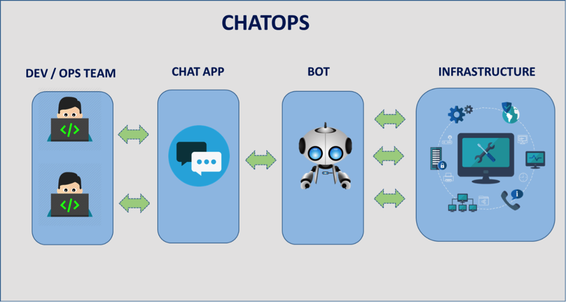

## What is it 
*ChatOps is a collaboration model that connects people, tools, process and automation into a transparent workflow.*

>Ref : http://www.no2now.com/chatops/

## Why to use a chatbot

- Make Dev and Ops collaborate without a re-org
- Connect distributed teams​
- Create a central point to manage/monitor your development, release and deployment process
- “hyper connectivity” between people and the continuous delivery pipeline​
- Add “super powers” with bots

  
## ChatOps applications

### Chat applications:

- slack
- flowdock
- msteams
- facebook
- ....

### Bot applications :

- hubot
- stackstorm
- Lita
- ....

 

 **\*\*\*Now let's try to create our first Hubot bot.\*\*\***