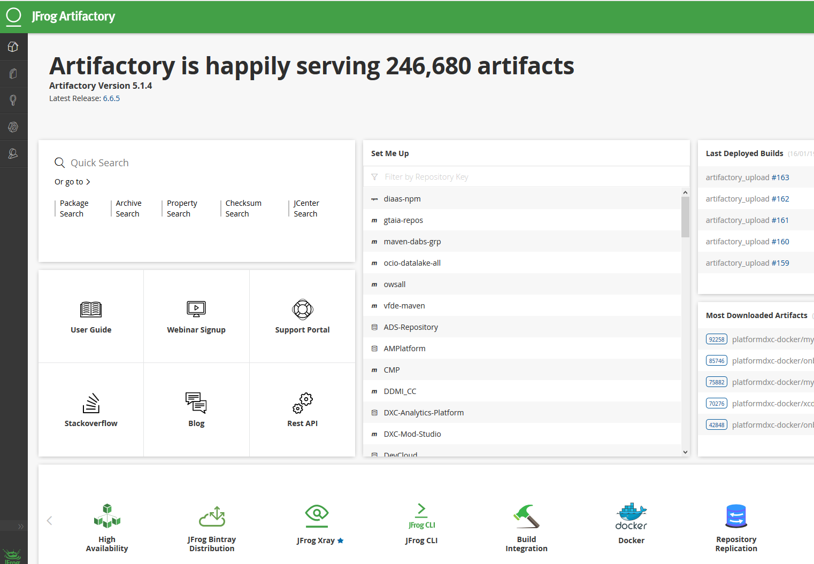

**Chun** is advocating the use of a Binary Management tool.

**Santhosh** who is leading the Kaizen event asks Chun to give the team an overview of Binary Management.

**Chun** explains that Version Control (using GitHub for example) and Binary Management are complementary. That GitHub is used for source code management and version control, primarily for plain text files. While Binary Management tools are used to manage and version the binaries produced from that source code.

As software gets built and packaged in the software development cycle, binaries also referred to as artifacts are produced. Chun outlines that there are many reasons including tagging, versioning, traceability and security why these artifacts should be packaged and stored in a binary package manager preferably via a CI pipeline.

Binary Management tools can also be used to

- To store third party binaries for use with package managers

- As a docker image repository.

**Dan** asks as to which Binary Management tool Chun would recommend.

**Chun** recommends Artifactory for Binary Management.

**Chun** explains Artifactory has been designed to optimize the storage and downloading of the binary files produced and consumed in the software development and deployment processes.

Artifactory helps organizations to manage the complexity resulting from an increasing number and types of binary artifacts and packages. Furthermore it can be integrated in workflows such as CI and CD pipelines which produce and consume those artifacts and packages. It also can be used to maintain metadata about the artifacts, supporting versioning and dependency management of the artifacts.

**Tina** inquires as to what role testing has to play in Binary Management.

**Chun** explains testing has a critical role to play in Binary Management. To ensure the quality of the artifacts, test automation suites should be executed successfully from CI pipelines before the artifacts are packaged and published to Artifactory.

**Paulo** the product owner upon the team confirming there is a consensus about using Artifactory as a Binary Management tool agrees to craft the epics and stories needed for the team to start using Artifactory for Binary Management.