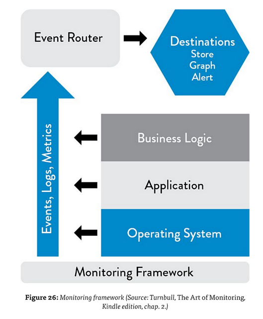

**Adam** I've worked with Chun and conducted some research into "what good looks like" for Monitoring. Most organisations draw a distinction between Logs / Events and Metrics. 

**Adam** Logs or Events are records of particular things happening at particular points in time (such as a user logging in, a new version of code being deployed or a process crashing) and Metrics are either "rate" details derived from the Events (e.g. the number of users logging in per hour) or are other measures of the health of the IT systems (CPU utilization of a server, memory footprint of a process, network bandwidth etc.)

**Chun** Best practice is to bring all the Logs / Events together into one place and to store the Metrics in a Time-Series Database so they can be easily displayed on a graph.

**Santhosh** If all the logs are in one place, with accurate time-stamps and in the correct order, that will make it really easy to identify Cause and Effect - we'll be able to see straight away which Events are Symptoms of a previous issue and what is the Root Cause.

**Chun** Absolutely. The other thing most organisations recommend is taking care to report Logs / Events and Metrics from all the levels of the system "stack" - from the Infrastructure, from the Application and also from the Business Logic. This is illustrated nicely in the following diagram taken from _The Art of Monitoring_.

**Adam** I agree that that way we would get a complete picture of what is happening.

 **Adam** Having graphs of the various Metrics will also let us understand "what normal looks like" at particular times of day, since we know that the load on our systems isn't constant and some variation in performance is to be expected.

**Adam** Ideally we'd generate automated Alerts whenever one of the Metrics passed a pre-defined Threshold value - but until we know where to set the Thresholds that's likely to cause confusion rather than preventing it.

**Paulo** Understood, we can add a stories to track the need to generate automate alerts for later.