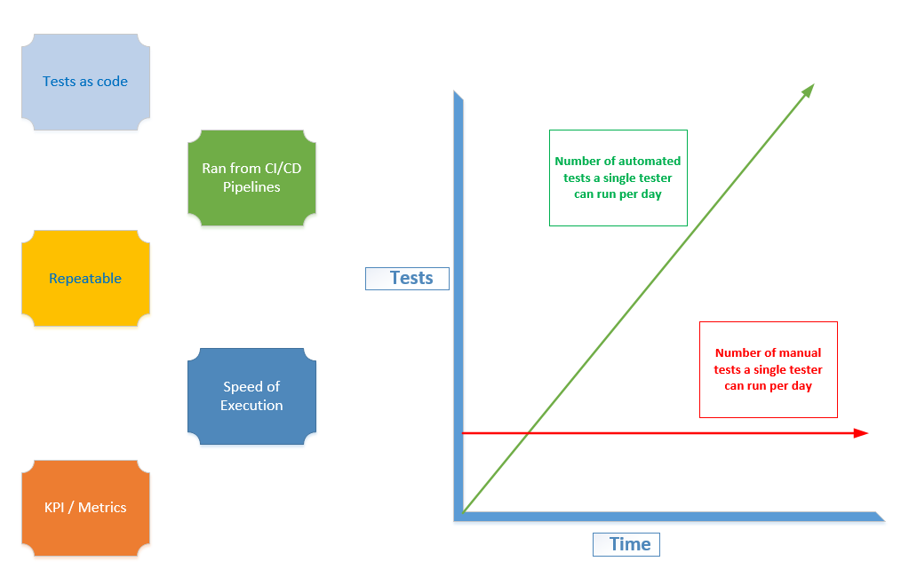

Following the teams discussion on their Test Automation Strategy. The team realize automating tests is critical to them being able to 

- Reduce their time to market.

- Increase their test coverage.

- Improve productivity,

They also realize that there are challenges facing them in meeting those objectives

- Team is relatively in experienced in test automation.

- Lack of test coverage.

- Test environment creation and maintenance.

- Test data setup and management.

- Challenges with end-to-end test creation

Chun by way of demonstrating those challenges should be met, shares a graph that illustrates how the speed of test cycle execution dramatically accelerates once test automation efforts are initiated.

The Pet Clinic team have a shared understanding of the importance and implications of test automation for

- Architecture

- Continuous Integration

- Continuous Delivery / Deployment

- Pre-Deployment

- LessOps

- Security

💡 **TIP**: Adjust the window size vertical scroller to make the welcome module easier to read ◀▶

