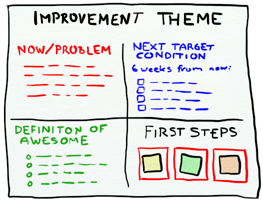

Improvement themes are comprised of five things.

1. The Name of the Improvement Theme.

2. Current State/Problem – Description of the current state including any problems or issues.

3. Definition of Awesome – Description of desired end state.

4. Next Target Condition – In X weeks from now, what will have changed?

5. First Steps – 3 slots for epics that describe the next actions the team will take towards the next target condition.

An improvement theme should be a living document. It could be a file in GitHub updated once or twice a week when the team reviews progress against the improvement theme and agrees upon new actions. The actions arising should then be used to populate the test automation epic in the product backlog.

For the Pet Clinic team the actions arising from the Test Automation Strategy Improvement Theme fall under one of three areas

* Assessing the current state of testing in the Pet Clinic development theme.

* Defining the desired state aka the definition of awesome of testing in the Pet Clinic development theme.

* Initiating a continuous improvement cycle with a focus on improving Test Automation practices in the Pet Clinic development theme.