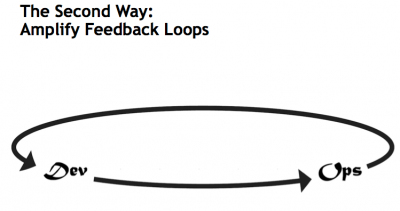
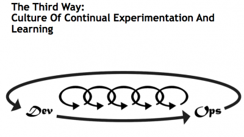

The Pet Clinic team have moved to a DevOps model. Their objective is to have unit, functional, integration and E2E testing ran from the CI/CD Pipelines. They also want to have certain non functional test suites ran against dedicated test environments, these suites are to be triggered on demand or to an agreed schedule.

While test automation is everyone's responsibility. A Test Automation sub team has been formed with **T**ina being the defacto product owner. The sub includes representatives from the development team and from the stakeholders responsible for the delivery of program level non functional testing.

The objectives for the implementation of a test automation strategy are aligned with the 3 Ways of DevOps

1. Take a - Systems Thinking - approach to test automation.

2. Amplify Feedback Loops - including deciding to make test automation metrics visible, sharing what deltas are identified and publishing the issues testing identifies.

3. Facilitate a Culture of Experimentation and Learning - including sharing at a program level of what works and just as importantly what doesn't work.

