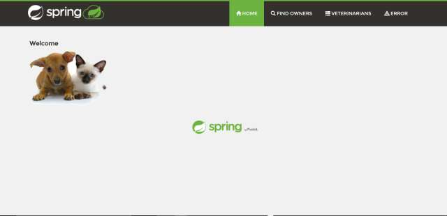

Welcome Back.

This is the ongoing story of a business, a team, an application and its delivery chain (their continuous delivery pipeline).

As you may recall the team is part of the IT organization of a large Pet Clinic. The Pet Clinic runs its business on a Java application. The application includes features to manage a list of clients (pet owners), their pets, and a list of veterinarians with their specialties.

The Pet Clinic IT team are still working to develop, test, deploy and support the Java application.

As the Pet Clinic team continue their DevOps journey their software development process is getting more efficient.

This is due to a variety of factors including

- Cultural - Use of Value Stream Mapping, Improvement Themes and DevOps Kaizen.

- Process - Introduction of CI pipelines, Source Code Management, Test Automation and a Shift Left on Security.

- Tooling - Including GitHub, Jenkins and various test automation tools.

However with the increasing efficiency, as is the way of things, new challenges are emerging for the team.

Come join us on the ongoing voyages of the Pet Clinic team on their continuing mission: to explore new DevOps principles and practices, to seek out new and better ways of doing things, to continue to boldly go where no Pet Clinic team has gone before...

💡 **TIP**: Adjust the window size vertical scroller to make the welcome module easier to read ◀▶
