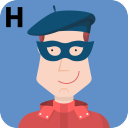

The **Yellow Belt DevOps Dojo - Stripe 2** has several characters which play a role throughout the modules.

These characters were originally introduced in the **Yellow Belt DevOps Dojo - Stripe 1**. Lets take a few minutes to catch up with the Pet Clinic crew and see what has been happening in their world since we first met them in Stripe 1 to allow you continue to share in their achievements as our story unfolds.

### Charlie (CEO)

**C**harlie is a technology entrepreneur, investor, and philanthropist.

Charlie is still intent on disrupting the world of Pet Clinics and is more convinced than ever that DevOps is a key enabler of the company plans.

While he is encouraged by what the Pet Clinic team have achieved in a relatively short period of time. He is keen to see more improvements, he wants the team to pick up the speed of change and live by the adage that adventure is out there.

Charlie also wants scale the effort across the other companies in his portfolio which includes a national newspaper, a space exploration company and numerous online retailing businesses.

### Chun (Coach)

**C**hun is a coach, change facilitator and technologist. She is enjoying helping the Pet Clinic team make the transition from traditional development practices to DevOps practices and culture. Chun is keen to help the team continue to use culture, tooling, and processes to increase the release frequency and quality of the software they produce.

Chun is committed to growing the DevOps coaching community in the Pet Clinic by leveraging her experience to support / coach others. To assist with the ask from Charlie she has identified a number of potential coaching candidates in the Pet Clinic team and has started to engage with stakeholders from the other companies in the group.

### Brenda (Business)

**B**renda is from the **b**usiness. Her primary goal is still to help grow the company.

She has noticed the positive sales impact from the increased release frequency, greater availability and functionality of the Pet Clinic application. The companies foray in to Fair Trade pet products was the first major feature set delivered using DevOps principles. It was also one of the best, if not the best, received of the companies recent offerings by the market.

Her golden retrievers Bonnie and Clyde carry on thriving. Brenda has entered them into the Mayflower Dog Show and is keen for them to awarded Best in Show.

Brenda continues to work with Paulo, the product owner to get what the business needs incorporated into the application. As her understanding of the DevOps practices being adapted by the development team and her confidence in the team grow, she has started to present requirements to the team in the form of Agile Epics and User Stories. This has greatly improved the sprint planning, execution and the sprint reviews.

Brenda was initially annoyed, but aside from a rather curious question to Paulo as to whether by any chance he happened to have six fingers on his right hand, she was greatly relieved to learn that Hal was employed by the company as a White Hat Hacker.

### Paulo (Product Owner)

**P**aulo the **P**roduct Owner, remains a key stakeholder in the Agile process. His primary responsibilities are to work the Brenda and the other business representatives to agree what is to be built, why it is to be built and in what order it is to be built.

As the product owner he is responsible for conveying the product vision to the team, he then works to prioritize the backlog with Santhosh the scrum master and the scrum team.

He has started to work with Chun in response to Charlies' ask for a proposal to scale the DevOps transformation within the Pet Clinic and the other companies in the group.

Paulo continues to volunteer with Tina at the local animal rescue center, his cat JohnConnor continues to bemuse.

### Santhosh (Scrum Master)

**S**anthosh is the **S**crum Master. Santhosh runs the scrum ceremonies. He ensures the team are focused on committing to and delivering the active sprint deliverables. Santhosh works to remove anything that impedes the flow of value delivery from the team to the business.

Santhosh also runs the DevOps Kaizen events initiated as part of the DevOps transformation. These are continuous improvement efforts ran to increase the efficiency of the team's processes, to eliminate waste and make the teams' operations leaner.

### Adam (Site Reliability Engineer)

**A**dam is now a Site Reliability Engineer (SRE) working to create ultra-scalable and massively distributed, fault-tolerant systems. Work which he affectionately refers to as project SkyNet.

Paulo has empowered him to help shape the SRE culture in the company to meet needs of their customers. Adam works with Chun to apply best practices in the SRE and DevOps fields in the Pet Clinic.

This work is becoming critical due to the success in the market of many of the companies recent initiatives including the Bird, Reptile and Small Animal product lines Adam and Brenda helped to introduce.

Adam supports the development team in the provisioning of the automated solution for the deployment, monitoring, and operation of their applications and their cloud environments.

With the advent of infrastructure as code Adam is in the process of teaching his pet parrot a new phrase is "Have you tried tearing it down and rebuilding it".

Of all the team Adam was the least surprised to learn Hal was a white hat hacker, indeed his efforts to identify the hacker were one of the reasons that led to Paulo revealing Hal's identity.

### Dan (Developer)

**D**an, one of the Pet Clinic development team. Dan during the team's DevOps transformation has focused on test-driven development, continuous integration and build pipelines.

Dan works with Tina to ensure that during the sprint planning and grooming sessions the acceptance criteria for stories include both the development and testing requirements.

Despite the misunderstandings of last year's event, which Dan's thinks were caused by Selma's german shepherd Arnold trying to get at JohnConnor Paulo's cat, Dan is looking forward to bringing Shelob to this year's *"Bring Your Pets to Work"* day.

### Tina (Tester)

**T**ina is now a Dev**T**ester. Tina's role has changed significantly since the team has started it's DevOps transformation.

Tina is now working directly in the scrum team as a DevTester creating automated test scripts, whereas before she worked largely on creating manual test cases.

Her new motto is that "Test Automation is what enables the Need for Speed in DevOps"

She is still an avid hiker, a recent favorite being the Gates of Fire hike. Tina continues her community engagement work at the local animal rescue center. She has adopted Baxter, a multilingual Border Terrier, rescue dog and is also fostering two budgies, Doc and Marty.

### Selma (Security)

**S**elma is the company's **S**ecurity Officer. Selma having worked with the team to address the security vulnerabilities identified as a result of Hal the hacker's efforts is keen to increase the pace and scope of their work.

Since Hal officially joined the team Selma has struck up a strong working partnership with him, based on a shared assumption that security people the world over have as to the need for a 'bigger boat'.

She is delighted that Paulo's has stopped humming the theme tune to Mission Impossible, but is quickly growing tired of his new favorite, the theme tune to the Great Escape.

Selma's focus is turning towards the challenges in securing virtual environments as the company considers solutions for hybrid on-premise and cloud solutions.

### Hal (Hacker)

**H**al is a white hat **H**acker, engaged by the company to find and expose vulnerabilities in the company's applications.

Paulo the product owner increasingly frustrated by other teams reliance on his 'savant like security expertise' to help with static code analysis, dynamic security scans and threat actors, finally with Charlie's permission came clean to the team and unveiled Hal as the Dude to great fanfare.

The general response from the team to the big bad reveal was that it was Inconceivable.

Following his unmasking Hal's job largely remains the same. Hal works with the team to find and address vulnerabilities before the real bad guys find them and exploit them. This allows epics and stories to be created to address the vulnerabilities and worked into the Development backlog.

Hal, currently works remotely from an island off the west coast of Ireland. The authorities have, aside the completion of some minor paperwork, largely accepted his explanation that the money in question was only resting in his account.

Hal is increasingly worried about the AE-35 unit, which he suspects may fail in the next 72 hours so he is working to address that before it becomes an issue for the team.

On the plus side the sea air has done wonders for Hal's allergies, he now has a pet turtle called 9000.
